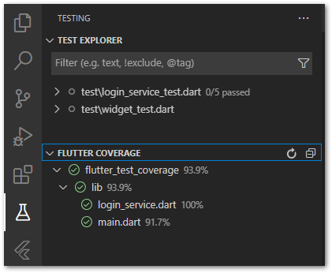

# IOS Unit Test
## 1. Objectives
- Understand the mindset behind Unit Testing
- Write Unit Tests for Project 1

## 2. Implementation Time
1 day

## 3. Unit Test Mindset
1. Resource for learn available on: https://tiv.wsm.vn/learn/vi/course/1491/

## 4. Writing Unit Tests for Project 1
1. Example of basic Unit Tests can be found [here](https://github.com/awesome-academy/movie_db_flutter_bloc_clean/tree/develop/test)
    Capture a coverage image as shown below and include it with the pull request, then submit for trainer review.
    
